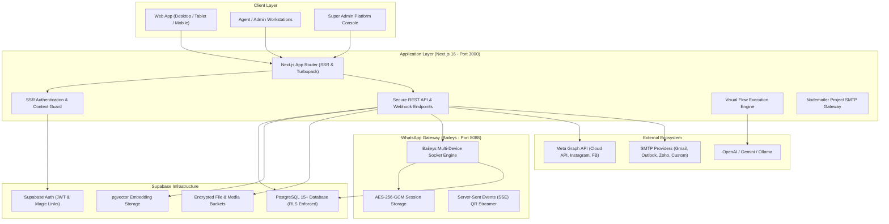
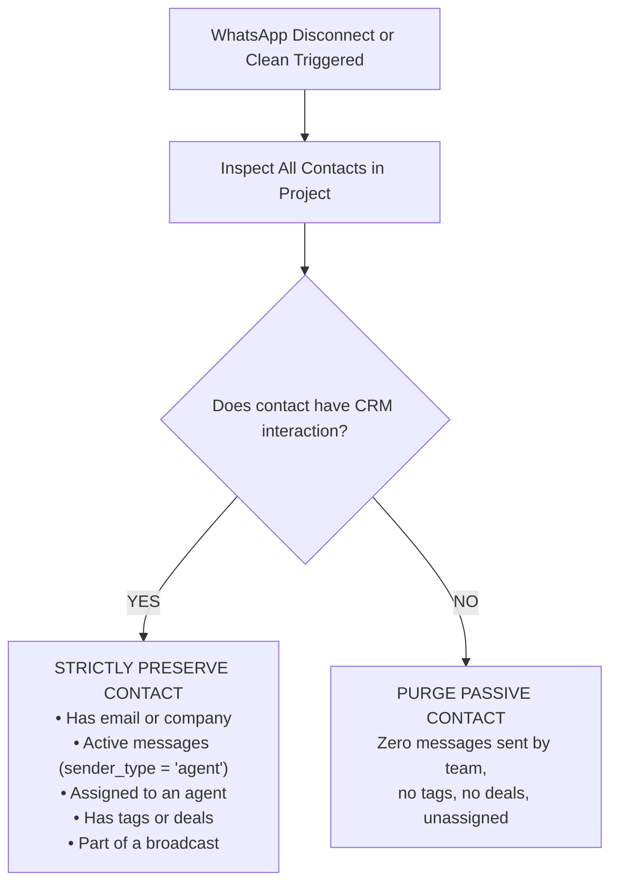

# CloudMaSa CRM (MaSa CRM) & Omnichannel Gateway
## Comprehensive Enterprise Architecture, Product & Production Operations Manual

---

## 1. Executive Summary & Product Vision

**CloudMaSa CRM (MaSa CRM)** is an enterprise-grade, multi-tenant Omnichannel Customer Relationship Management (CRM) and Marketing Automation platform. Engineered specifically for high-velocity sales, customer support, and automated conversational commerce, it bridges the gap between traditional CRM databases and modern messaging channels:

- **WhatsApp Web QR Code Connection**: Independent, lightweight Baileys-powered multi-device gateway requiring zero Meta Business verification.
- **Meta WhatsApp Cloud API**: Official WhatsApp Business Platform with template synchronization, interactive messages, and webhook verification.
- **Social Inboxes**: Instagram Direct & Facebook Messenger synchronized into a single unified conversation stream.
- **Project-Specific Email Campaign Gateway**: Dedicated SMTP engine per project (Gmail, Outlook/Office 365, Zoho, Custom SMTP) with open/click tracking and dynamic merge tags.
- **Visual Automation Flow Builder**: Interactive drag-and-drop node canvas for triggers, conditions, branching, human handoff, and LLM-driven AI agents.
- **AI Knowledge Base (RAG Engine)**: Context-aware conversational AI grounded on company documents, PDFs, and FAQs with semantic search using `pgvector`.
- **Smart Contact Lifecycle & Cleanup**: Automatic cleanup of passive WhatsApp address book syncs while guaranteeing preservation of CRM-engaged contacts.
- **Enterprise Multi-Tenancy & RBAC**: Hierarchical account/project isolation with Super Admin provisioning, Designated Default Admin safeguards, and dynamic Agent role management.

---

## 2. System Architecture & Topology



---

## 3. Multi-Tenancy, Projects & Role-Based Access Control (RBAC)

### 3.1 Tenant Hierarchy
```
┌─────────────────────────────────────────────────────────────┐
│                      Super Admin Account                    │
│   (Global Tenant Provisioning, Telemetry, Cross-Project)    │
└──────────────────────────────┬──────────────────────────────┘
                               │
                ┌──────────────┴──────────────┐
                ▼                             ▼
    ┌──────────────────────────┐  ┌──────────────────────────┐
    │    Account / Client A    │  │    Account / Client B    │
    │    (Billing Boundary)    │  │    (Billing Boundary)    │
    └────────────┬─────────────┘  └────────────┬─────────────┘
                 │                             │
         ┌───────┴───────┐             ┌───────┴───────┐
         ▼               ▼             ▼               ▼
   ┌───────────┐   ┌───────────┐ ┌───────────┐   ┌───────────┐
   │ Project 1 │   │ Project 2 │ │ Project 3 │   │ Project 4 │
   │ (Sales)   │   │ (Support) │ │ (Marketing│   │ (VIP)     │
   └───────────┘   └───────────┘ └───────────┘   └───────────┘
```

1. **Account (`accounts`)**: Highest-level organization unit managing billing, global features, and platform identity.
2. **Project (`projects`)**: Complete data-isolation boundary. Every contact, conversation, WhatsApp session, email config, pipeline deal, automation flow, and API key is strictly scoped to a single `project_id`.
3. **Session Switching**: Users switch projects effortlessly via the top navigation bar. When active, all data fetching (`masacrm_project` cookie) automatically bounds queries to that project's boundary.

---

### 3.2 Role Permissions Matrix & Designated Default Admin

| Capability / Action | Super Admin | Default Admin (`default_admin`) | Project Admin | Agent |
| :--- | :---: | :---: | :---: | :---: |
| Access Global Platform `/admin` | ✅ | ❌ | ❌ | ❌ |
| Create / Delete Client Accounts & Projects | ✅ | ❌ | ❌ | ❌ |
| Demote / Delete Default Primary Admin | ✅ | ❌ | ❌ | ❌ |
| Switch Other Members (Agent $\leftrightarrow$ Admin) | ✅ | ✅ | ✅ | ❌ |
| Connect / Disconnect Project WhatsApp & Email | ✅ | ✅ | ✅ | ❌ |
| Configure Visual Automation Flows & Triggers | ✅ | ✅ | ✅ | ❌ |
| Access Unified Inbox & Reply to Customers | ✅ | ✅ | ✅ | ✅ |
| Update Deal Stages, Tags, and Custom Fields | ✅ | ✅ | ✅ | ✅ |
| View Assigned Conversations & Claim Chats | ✅ | ✅ | ✅ | ✅ |

#### The Designated Default Admin Safeguard
- When the Super Admin provisions a customer account, the primary contact is marked with the `default_admin` tag (`is_default_admin = true`) in the database.
- **Protection**: Other project administrators cannot accidentally demote, lock out, or delete the primary default admin. A distinctive purple badge appears in the **Settings $\to$ Team Members** UI.
- Other team members can freely be elevated to Admin or transitioned back to Agent by the Default Admin or Super Admin.

---

## 4. Channels & Messaging Architecture

### 4.1 WhatsApp Web QR Gateway (Baileys Multi-Device)
- **Protocol**: Native WhatsApp Web multi-device WebSockets connection via `@whiskeysockets/baileys`.
- **Zero-Meta Approval**: Works with standard WhatsApp and WhatsApp Business phone numbers without requiring Meta Business verification.
- **Port & Process**: Runs on dedicated microservice port `8088` (or customizable via `WHATSAPP_GATEWAY_URL`).
- **Features**:
  - Real-time QR pairing string streamed to frontend via Server-Sent Events (SSE).
  - AES-256-GCM encrypted session credentials stored in PostgreSQL `qr_sessions`.
  - Full support for Inbound/Outbound text, images, videos, audio, PDF documents, voice notes, reaction emojis, and delivery receipts (`sent`, `delivered`, `read`).
  - Automatic reconnection, keep-alive heartbeats, and graceful disconnect handling.

---

### 4.2 WhatsApp Address Book Sync & Smart Contact Cleanup Engine
When a WhatsApp device connects, WhatsApp automatically syncs the phone's personal address book. In high-volume environments, this can inject hundreds of non-customer contacts into the database.

CloudMaSa CRM solves this with a built-in **Smart Cleanup Engine** ([`src/lib/contacts/cleanup-synced.ts`](file:///c:/Users/Admin/Downloads/whatsappcrm-qr-gateway%20(1)-/whatsappcrm-qr-gateway/src/lib/contacts/cleanup-synced.ts)):



- **Automatic Trigger**: Automatically executes whenever a WhatsApp session is disconnected (`DELETE /api/whatsapp/qr`, gateway `session.disconnected`, or `session.logout`).
- **On-Demand Trigger**: Available directly in **Settings $\to$ Channels $\to$ Clean Synced Contacts** or via `POST /api/contacts/cleanup-synced`.
- **Safety Guarantee**: Only completely un-interacted address book entries are purged; all customer conversations and pipeline leads are 100% retained.

---

### 4.3 Project-Specific Email Connection & SMTP Campaign Engine
Email campaigns and client notifications are **strictly isolated per project** ([`src/lib/email/transport.ts`](file:///c:/Users/Admin/Downloads/whatsappcrm-qr-gateway%20(1)-/whatsappcrm-qr-gateway/src/lib/email/transport.ts)):

- **Database Structure**: Stored in `public.email_configs` with `UNIQUE (project_id)`.
- **Supported Providers & Quick Presets**:
  - **Gmail / Google Workspace**: Dedicated App Password setup (`smtp.gmail.com:587` / `465`).
  - **Microsoft Outlook / Office 365**: Direct TLS SMTP (`smtp.office365.com:587`).
  - **Zoho Mail**: Secure Zoho SMTP (`smtp.zoho.com:465`).
  - **Custom SMTP**: Any corporate or self-hosted mail server.
- **Zero Cross-Project Leakage**:
  - Each project manages its own sending address and display name.
  - Sibling projects never share or leak email credentials.
  - Campaigns for an unconfigured project will reject sending rather than mistakenly sending from another client's address.
- **Campaign Capabilities**:
  - Dynamic Merge Tags: `{{name}}`, `{{email}}`, `{{company}}`.
  - 1x1 Transparent Open Tracking Pixel automatically injected before `</body>`.
  - Click-Tracking URL Rewriting (`/api/email/track/click/[token]`).
  - Detailed recipient delivery logs (`email_campaign_recipients`).

---

### 4.4 Meta WhatsApp Cloud API & Social Inboxes
- **Meta WhatsApp Cloud API**: Direct Graph API (`v21.0`) integration for enterprise WhatsApp Business Accounts (WABA) with official template sync, HSM approvals, and quick-reply buttons.
- **Instagram Direct**: Live DM syncing, story mentions, and customer profile ingestion.
- **Facebook Messenger**: Facebook Page messaging with two-way media and attachment handling.
- **Channel Readiness Health Monitor** (`/api/channels/readiness`): Provides instant visual status across all channels for any active project.

---

## 5. Core Platform Modules

### 5.1 Unified Omnichannel Inbox
- **Real-Time Synchronization**: Built on Supabase Realtime CDC and Server-Sent Events for instant message delivery without page reloads.
- **Chat Management**: Filter by channel (`WhatsApp QR`, `Cloud API`, `Instagram`, `Facebook`), assignment (`My Chats`, `Unassigned`, `All`), and status (`Open`, `Pending`, `Resolved`).
- **Agent Collaboration**: Internal private notes (`contact_notes`), typing indicators, and seamless chat transfer between agents.
- **Rich Media & Reactions**: Audio recorder/player for voice notes, image gallery viewer, PDF previews, and emoji reactions.

### 5.2 Contacts & Lead Management
- **Custom Attributes**: Flexible custom field definitions (Text, Number, Date, Dropdown, Boolean).
- **Tagging System**: Multi-color tagging with automated trigger hooks into visual workflows.
- **CSV Ingestion**: Bulk contact import with column mapping, international E.164 phone formatting, and duplicate resolution.

### 5.3 Deals & Sales Pipeline
- **Kanban Board**: Drag-and-drop pipeline stages (`Lead`, `Contacted`, `Qualified`, `Proposal`, `Negotiation`, `Won`, `Lost`).
- **Multi-Currency Support**: Formatted for USD, EUR, INR, GBP, AED, and customizable currency symbols.
- **Conversion Tracking**: Visual analytics showing stage velocity and total pipeline monetary value.

### 5.4 Visual Automation Flow Builder
- **Node-Based Canvas**: Drag-and-drop workflow designer powered by React Flow.
- **Triggers**: Inbound Message, Keyword Match, Tag Added, Deal Stage Changed, Webhook Received.
- **Condition Nodes**: Custom field checks, Business Hours/Time routing, Channel filters.
- **Action Nodes**: Send Message, Send Template, Add/Remove Tags, Update Custom Field, Assign to Agent.
- **AI Router & Handoff**: Connects to the RAG engine for automated conversational answers, with automatic fallback to human agents when confidence is low.

### 5.5 AI Knowledge Base (RAG Engine)
- Ingests company documentation, product catalogs, PDFs, and standard operating procedures.
- Generates vector embeddings using OpenAI `text-embedding-3-small` or local Ollama instances.
- Stores vectors in PostgreSQL using `pgvector`.
- Automatically retrieves top-K matching knowledge chunks and provides context-grounded answers to customer queries.

---

## 6. Security, Cryptography & Data Governance

| Security Domain | Architecture & Standard |
| :--- | :--- |
| **Credential Encryption** | WhatsApp QR sessions, API keys, and SMTP passwords encrypted at rest using **AES-256-GCM** via server-side `ENCRYPTION_KEY`. |
| **Row Level Security (RLS)** | Enabled on all PostgreSQL tables. Ensures callers only access data where `account_id` and `project_id` match their authenticated session. |
| **SSR Cookie Authentication** | Next.js Server Components and API routes read secure `HttpOnly` Supabase session cookies (`sb-<ref>-auth-token`). |
| **Webhook Verification** | Inbound Meta Graph webhooks validated via `X-Hub-Signature-256` HMAC-SHA256. QR Gateway webhooks verified via `WHATSAPP_GATEWAY_SIGNING_SECRET`. |
| **SSRF Protection** | Outbound webhook dispatchers validate target hosts, blocking loopback and private subnets (`127.0.0.1`, `10.0.0.0/8`, `192.168.0.0/16`, AWS/GCP metadata endpoints). |
| **Audit Trails** | All user onboarding, role changes, project mutations, and deletions recorded in `security_audit_logs`. |

---

## 7. Environment Variables Reference (`.env`)

```ini
# ==============================================================================
# CloudMaSa CRM (MaSa CRM) Environment Configuration
# ==============================================================================

# --- Supabase Database & Authentication ---
NEXT_PUBLIC_SUPABASE_URL=https://twpuqntljgavimlocplg.supabase.co
NEXT_PUBLIC_SUPABASE_ANON_KEY=eyJhbGciOiJIUzI1NiIsInR5cCI6IkpXVCJ9...
SUPABASE_SERVICE_ROLE_KEY=eyJhbGciOiJIUzI1NiIsInR5cCI6IkpXVCJ9...

# --- Application URLs & Localization ---
NEXT_PUBLIC_SITE_URL=http://localhost:3000
NEXT_PUBLIC_APP_LOCALE=en

# --- Cryptography (64-character hex string for AES-256-GCM) ---
ENCRYPTION_KEY=0818e6bd2f12b6e14376567ff2da1f16311f4a1c6e947b4221af1d523cd6f4a5

# --- WhatsApp QR Baileys Gateway Service ---
WHATSAPP_GATEWAY_URL=http://localhost:8088
WHATSAPP_GATEWAY_TOKEN=bb51f78d8402e36fd2551b4983fa5d35319b5c22a1b0a551950c23f90d371b38
WHATSAPP_GATEWAY_SIGNING_SECRET=ccbd77a6fb045ee05fc331def15725fa3e79a81f01d738f11f485f2c08af5bc2
WHATSAPP_GATEWAY_WEBHOOK_SECRET=267377ac40f018c2776184eca45af13d9a725847350c95964681d76e17eaf27c

# --- System Onboarding SMTP Service (Fallback for New Admin Invitations) ---
SMTP_HOST=smtp.gmail.com
SMTP_PORT=587
SMTP_SECURE=false
SMTP_USER=info@cloudmasa.com
SMTP_PASS=octv mgwu jnse gknm
SMTP_FROM=info@cloudmasa.com
SMTP_FROM_NAME="CloudMaSa WhatsApp CRM"

# --- AI & Knowledge Base Providers (Optional) ---
OPENAI_API_KEY=sk-...
GEMINI_API_KEY=AIzaSy...
```

---

## 8. Developer Quick Start & Operations Guide

### 8.1 Local Development Setup

#### 1. Prerequisites
- **Node.js**: v20+ or v24 LTS
- **Package Manager**: `npm`
- **Supabase**: Active Supabase project with PostgreSQL 15+

#### 2. Start Application Server
```bash
# Install root dependencies
npm install

# Start Next.js App Router server (Port 3000)
npm run dev
```

#### 3. Start WhatsApp Baileys Gateway Server
```bash
# Navigate to gateway microservice directory
cd gateway

# Install gateway dependencies
npm install

# Start Baileys gateway service (Port 8088)
npm run dev
```

The application will be live at `http://localhost:3000` and the gateway microservice at `http://localhost:8088`.

---

### 8.2 Production Build & Quality Checks
```bash
# 1. Typecheck the entire TypeScript codebase
npm run typecheck

# 2. Run automated test suites (Vitest)
npm run test:run

# 3. Create production bundle
npm run build

# 4. Start production Next.js server
npm run start
```

---

### 8.3 Docker & Docker Compose Deployment
The repository includes production multi-stage Dockerfiles and `docker-compose.yml`:

```bash
# Build and run web application and gateway in background
docker compose up -d --build

# View logs
docker compose logs -f
```

---

## 9. Verification & Automated Test Matrix

The platform undergoes rigorous automated testing to prevent regressions across releases:

- **TypeScript Compilation**: `0 errors` (`tsc --noEmit`).
- **Vitest Unit & Integration Suites**: **71 test suites / 762 automated tests passing**.
- **Email Flow & Isolation Suite**: [`src/lib/email/email-flow.test.ts`](file:///c:/Users/Admin/Downloads/whatsappcrm-qr-gateway%20(1)-/whatsappcrm-qr-gateway/src/lib/email/email-flow.test.ts) validates project email isolation, merge tag replacement, open/click tracking URLs, and preset configurations.
- **End-to-End Live Workflow**: Validated across all 11 core CRM operations (Authentication, Protected Default Admin, Team Role Management, Project SMTP, Contact Cleanup, Unified Inbox, QR Gateway, Templates, Campaigns, and Readiness).

---

## 10. REST API Quick Reference (`/api/v1`)

All external API endpoints authenticate using Bearer API tokens generated in **Settings $\to$ API Keys**:

| Endpoint | Method | Description |
| :--- | :---: | :--- |
| `/api/v1/contacts` | `GET` | Paginated contact listing (`?page=1&limit=50`). |
| `/api/v1/contacts` | `POST` | Create or update a contact with custom attributes. |
| `/api/v1/contacts/{id}` | `GET` | Retrieve full contact profile and conversation timeline. |
| `/api/v1/messages` | `POST` | Dispatch outbound WhatsApp/SMS message. |
| `/api/v1/webhooks` | `POST` | Register real-time webhook subscriptions. |
| `/api/channels/readiness` | `GET` | Channel health check for active project. |
| `/api/email/config` | `GET/POST/DELETE` | Project-scoped SMTP configuration. |
| `/api/contacts/cleanup-synced`| `POST` | Purge un-used WhatsApp synced contacts while preserving CRM contacts. |

---

*Documentation maintained by the CloudMaSa Engineering Team • CloudMaSa CRM (MaSa CRM).*
