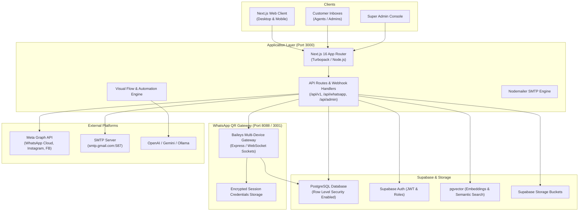

# CloudMaSa WhatsApp CRM (WACRM) & Omnichannel Gateway
## End-to-End Enterprise Architecture, Product & Production Operations Guide

---

## 1. Executive Summary & Product Overview

**CloudMaSa WhatsApp CRM (WACRM)** is an enterprise-grade, multi-tenant Omnichannel Customer Relationship Management (CRM) platform built specifically for modern conversational commerce and customer support.

The platform bridges the gap between traditional CRM workflows (leads, pipelines, custom attributes, tags) and multi-channel instant messaging:
- **WhatsApp Web QR Code Connection**: Independent, lightweight Baileys-powered multi-device gateway requiring zero Meta Business verification.
- **Meta WhatsApp Cloud API**: Official WhatsApp Business Platform with template sync, interactive messages, and webhook verification.
- **Instagram Direct & Facebook Messenger**: Unified social media inbox.
- **Visual Automation Flow Builder**: Node-based automation canvas for triggers, conditions, branching, human handoff, and LLM-assisted conversational bots.
- **AI Knowledge Base (RAG)**: AI Agents grounded on custom business documents, PDFs, and FAQs with automatic context injection.
- **Super Admin Multi-Tenancy**: Granular project isolation, one-click customer provisioning with automatic SMTP welcome emails, and cascading lifecycle management.

---

## 2. System Architecture & Component Topology



---

## 3. Multi-Tenant Architecture & Data Isolation

### 3.1 Tenant Hierarchy
```
┌─────────────────────────────────────────────────────────────┐
│                      Super Admin Account                    │
│   (Full control, Tenant Provisioning, System Telemetry)     │
└──────────────────────────────┬──────────────────────────────┘
                               │
                ┌──────────────┴──────────────┐
                ▼                             ▼
   ┌──────────────────────────┐  ┌──────────────────────────┐
   │    Account / Client A    │  │    Account / Client B    │
   │    (Organisation Unit)   │  │    (Organisation Unit)   │
   └────────────┬─────────────┘  └────────────┬─────────────┘
                │                             │
        ┌───────┴───────┐             ┌───────┴───────┐
        ▼               ▼             ▼               ▼
  ┌───────────┐   ┌───────────┐ ┌───────────┐   ┌───────────┐
  │ Project 1 │   │ Project 2 │ │ Project 3 │   │ Project 4 │
  │ (Retail)  │   │ (Support) │ │ (Sales)   │   │ (VIP)     │
  └───────────┘   └───────────┘ └───────────┘   └───────────┘
```

1. **Account (`accounts`)**: Top-level tenant billing boundary.
2. **Project (`projects`)**: Complete data-isolation silo. Every contact, conversation, message, WhatsApp configuration, pipeline, automation, and API key belongs to a specific `project_id`.
3. **Roles & Permissions**:
   - **`super_admin`**: Global system administrator. Can access `/admin`, create/delete projects, provision customer credentials, inspect audit logs, and view cross-tenant channel health.
   - **`admin` (Project Administrator)**: Manages channels, team members, automations, templates, and settings within their assigned project.
   - **`agent` (Support / Sales Agent)**: Interacts with the unified inbox, manages contacts, updates deal stages, and executes quick replies without access to project-level settings.

### 3.2 Automated Customer Onboarding & Cascading Deletion
- **Creation (`POST /api/admin/users`)**:
  1. Creates Supabase Auth user record.
  2. Generates customer profile and links `account_id` and `platform_role = 'customer'`.
  3. Assigns project membership in `project_members`.
  4. Dispatches an automated branded welcome email via Nodemailer SMTP with temporary password and direct workspace URL (`https://wacrm.cloudmasa.com/login`).
  5. Displays on-screen credentials handover modal with one-click clipboard copy.
- **Deletion (`DELETE /api/projects/[id]`)**:
  1. Automatically identifies all customer accounts and agents assigned to the project.
  2. Deletes user records from `onboarded_customers`, `project_members`, `profiles`, and `auth.users` in Supabase Auth.
  3. Purges all messages, conversations, media, contacts, deals, automations, flows, and channel configs.
  4. Protects the acting Super Admin account from accidental deletion.

---

## 4. Channels & Messaging Engines

### 4.1 WhatsApp QR Baileys Gateway
- **Mechanism**: Connects via WhatsApp Web multi-device socket protocol using `@whiskeysockets/baileys`.
- **Key Capabilities**:
  - Real-time QR code generation streamed via Server-Sent Events (SSE).
  - Encrypted auth credentials stored in PostgreSQL `qr_sessions` table with AES-256-GCM encryption.
  - Inbound & outbound text, media (images, videos, audio, PDF documents, voice notes), reaction emojis, and read receipts.
  - Automatic reconnection handling, keep-alive heartbeat, and disconnect diagnostics.
- **Gateway Endpoints**:
  - `POST /api/whatsapp/qr/session`: Initialize or retrieve QR pairing string.
  - `DELETE /api/whatsapp/qr/session`: Log out and purge stored session.
  - `POST /api/whatsapp/qr/send`: Dispatch outbound message through Baileys socket.

### 4.2 Meta WhatsApp Cloud API
- **Mechanism**: Official Meta Graph API integration (`v21.0`).
- **Key Capabilities**:
  - Official WhatsApp Business Account (WABA) registration and PIN verification.
  - Two-way Webhook processing with HMAC-SHA256 signature verification (`X-Hub-Signature-256`).
  - Template Message Sync, creation, variable mapping, media headers, and submit-for-approval flow.
  - Interactive messages (List messages, Quick reply buttons, CTA URL buttons).

### 4.3 Social Media Channels
- **Instagram Direct**: Real-time DM syncing, story mentions, and customer conversation threading.
- **Facebook Messenger**: Page inbox synchronization with support for rich text and attachments.

---

## 5. Core Platform Modules

### 5.1 Unified Omnichannel Inbox
- **Real-Time Synchronization**: Backed by Supabase PostgreSQL CDC (Change Data Capture) and Server-Sent Events.
- **Conversation Management**:
  - Filter by status (`Open`, `Pending`, `Resolved`, `Spam`), channel (`QR`, `Cloud API`, `Instagram`, `Facebook`), and assigned agent.
  - Internal Team Notes (`contact_notes`) for collaborative triage.
  - Typing indicators & presence tracking (`presence.ts`).
  - Emoji reaction picker with instant remote synchronization.
  - Rich media viewer for audio recordings, video players, and inline PDF previews.

### 5.2 Contact & Lead Management
- **Custom Data Attributes**: Dynamic field builder (`custom_fields`) supporting strings, numbers, dates, dropdowns, and booleans.
- **Color-Coded Tags**: Granular tag categorization with trigger dispatches for automations.
- **CSV Ingestion Engine**: High-speed CSV parser with field mapping, phone number standardisation (E.164), and deduplication rules.

### 5.3 Visual Automation Flow Builder
- **Canvas**: Node-based visual drag-and-drop workflow canvas built on React Flow.
- **Node Types**:
  - **Triggers**: Inbound Message Received, Keyword Match, Tag Added, Contact Created.
  - **Conditions**: Check custom field value, time-of-day / business hours check, channel check.
  - **Actions**: Send WhatsApp Message, Send Template, Add/Remove Tags, Update Custom Field, Assign Agent, Trigger Webhook.
  - **AI / Handoff**: Route to AI Agent with RAG prompt, Human Handoff flag.

### 5.4 Deals & Sales Pipeline
- **Kanban Board**: Drag-and-drop stages (`Lead`, `Contacted`, `Qualified`, `Proposal`, `Negotiation`, `Won`, `Lost`).
- **Multi-Currency Support**: Configurable currency formatting (USD, EUR, INR, GBP, AED, etc.).
- **Deal Metrics**: Real-time conversion tracking and pipeline value aggregation.

### 5.5 AI Knowledge Base & RAG Engine
- **Document Chunking & Embeddings**: Ingests company documentation, policies, and product catalogs. Generates vector embeddings via OpenAI `text-embedding-3-small` or local Ollama.
- **Vector Storage**: Stored in PostgreSQL with `pgvector` indexing.
- **Context Injection**: Automatically injects top-$K$ semantic document chunks into the conversation buffer when the AI auto-reply agent responds to customers.

---

## 6. Security, Cryptography & Governance

| Security Layer | Implementation Details |
| :--- | :--- |
| **Token Encryption** | Access tokens, WhatsApp QR credentials, and API secrets are encrypted at rest using **AES-256-GCM** via `ENCRYPTION_KEY`. |
| **Row Level Security (RLS)** | Enabled on all PostgreSQL tables. Ensures callers only access data where `account_id` or `project_id` matches their authenticated session. |
| **Webhook Verification** | Inbound Meta webhooks validated via `X-Hub-Signature-256` HMAC-SHA256. QR Gateway webhooks verified via `GATEWAY_SIGNING_SECRET`. |
| **SSRF Guard** | Webhook dispatcher inspects URLs and blocks local/private IP ranges (`127.0.0.1`, `10.0.0.0/8`, `192.168.0.0/16`, cloud metadata endpoints). |
| **Audit Trails** | All administrative actions, user creation/deletion, and project mutations logged in `security_audit_logs`. |

---

## 7. Environment Variables Reference (`.env`)

```ini
# ==============================================================================
# CloudMaSa WhatsApp CRM (WACRM) Environment Configuration
# ==============================================================================

# --- Supabase Database & Auth ---
NEXT_PUBLIC_SUPABASE_URL=https://twpuqntljgavimlocplg.supabase.co
NEXT_PUBLIC_SUPABASE_ANON_KEY=eyJhbGciOiJIUzI1NiIsInR5cCI6IkpXVCJ9...
SUPABASE_SERVICE_ROLE_KEY=eyJhbGciOiJIUzI1NiIsInR5cCI6IkpXVCJ9...

# --- Application URLs ---
NEXT_PUBLIC_SITE_URL=https://wacrm.cloudmasa.com
NEXT_PUBLIC_APP_LOCALE=en

# --- Cryptography (64 hex characters) ---
ENCRYPTION_KEY=0818e6bd2f12b6e14376567ff2da1f16311f4a1c6e947b4221af1d523cd6f4a5

# --- WhatsApp QR Baileys Gateway ---
WHATSAPP_GATEWAY_URL=http://localhost:8088
WHATSAPP_GATEWAY_TOKEN=bb51f78d8402e36fd2551b4983fa5d35319b5c22a1b0a551950c23f90d371b38
WHATSAPP_GATEWAY_SIGNING_SECRET=ccbd77a6fb045ee05fc331def15725fa3e79a81f01d738f11f485f2c08af5bc2
WHATSAPP_GATEWAY_WEBHOOK_SECRET=267377ac40f018c2776184eca45af13d9a725847350c95964681d76e17eaf27c

# --- SMTP / Onboarding Email Service ---
SMTP_HOST=smtp.gmail.com
SMTP_PORT=587
SMTP_SECURE=false
SMTP_USER=info@cloudmasa.com
SMTP_PASS=octv mgwu jnse gknm
SMTP_FROM=info@cloudmasa.com
SMTP_FROM_NAME="CloudMaSa WhatsApp CRM"

# --- AI & LLM Providers (Optional) ---
OPENAI_API_KEY=sk-...
GEMINI_API_KEY=AIzaSy...
```

---

## 8. Production Deployment & Operations Guide

### 8.1 Docker Compose Deployment
The repository includes a multi-container `docker-compose.yml` for zero-downtime production deployment:

```yaml
version: '3.8'

services:
  web:
    build:
      context: .
      dockerfile: Dockerfile
    container_name: wacrm-web
    restart: unless-stopped
    ports:
      - "3000:3000"
    env_file:
      - .env
    environment:
      - NODE_ENV=production
    depends_on:
      - gateway

  gateway:
    build:
      context: ./gateway
      dockerfile: Dockerfile
    container_name: wacrm-qr-gateway
    restart: unless-stopped
    ports:
      - "8088:8088"
    env_file:
      - .env
    environment:
      - NODE_ENV=production
      - PORT=8088
```

### 8.2 Production Build & Startup Commands
```bash
# 1. Install dependencies
npm install --frozen-lockfile

# 2. Run database migrations
npx supabase db push

# 3. Validate TypeScript type safety
npm run typecheck

# 4. Run automated test suites
npm run test:run

# 5. Build production bundle
npm run build

# 6. Start production server
npm run start
```

### 8.3 Nginx Reverse Proxy Configuration
```nginx
server {
    listen 80;
    server_name wacrm.cloudmasa.com;
    return 301 https://$host$request_uri;
}

server {
    listen 443 ssl http2;
    server_name wacrm.cloudmasa.com;

    ssl_certificate /etc/letsencrypt/live/wacrm.cloudmasa.com/fullchain.pem;
    ssl_certificate_key /etc/letsencrypt/live/wacrm.cloudmasa.com/privkey.pem;

    # Client upload size (for attachments and CSVs)
    client_max_body_size 64M;

    location / {
        proxy_pass http://127.0.0.1:3000;
        proxy_http_version 1.1;
        proxy_set_header Upgrade $http_upgrade;
        proxy_set_header Connection "upgrade";
        proxy_set_header Host $host;
        proxy_set_header X-Real-IP $remote_addr;
        proxy_set_header X-Forwarded-For $proxy_add_x_forwarded_for;
        proxy_set_header X-Forwarded-Proto $scheme;
        proxy_read_timeout 86400s;
        proxy_send_timeout 86400s;
    }
}
```

---

## 9. REST API Reference (`/api/v1`)

All REST API endpoints authenticate via Bearer API Keys created in **Settings $\to$ API Keys**.

### 9.1 Contacts
- `GET /api/v1/contacts`: List contacts with pagination (`?page=1&limit=50`).
- `POST /api/v1/contacts`: Create or update a contact.
- `GET /api/v1/contacts/{id}`: Retrieve contact profile, custom fields, and conversation history.

### 9.2 Messages
- `POST /api/v1/messages`: Dispatch an outbound message.
  ```json
  {
    "to": "+919876543210",
    "type": "text",
    "text": "Hello! Your order has been dispatched."
  }
  ```

### 9.3 Webhooks
- `POST /api/v1/webhooks`: Register a webhook endpoint to receive real-time events (`message.received`, `message.delivered`, `contact.created`, `deal.updated`).

---

## 10. Verification & Quality Standards

- **TypeScript Typecheck**: `0 errors` (`tsc --noEmit`).
- **Vitest Test Suite**: **71 test suites / 762 automated unit and integration tests passing cleanly**.
- **Security Audits**: Comprehensive RLS enforcement across all tables and encrypted credential storage.

---
*Documentation maintained by CloudMaSa Engineering Team • CloudMaSa WhatsApp CRM (WACRM).*
